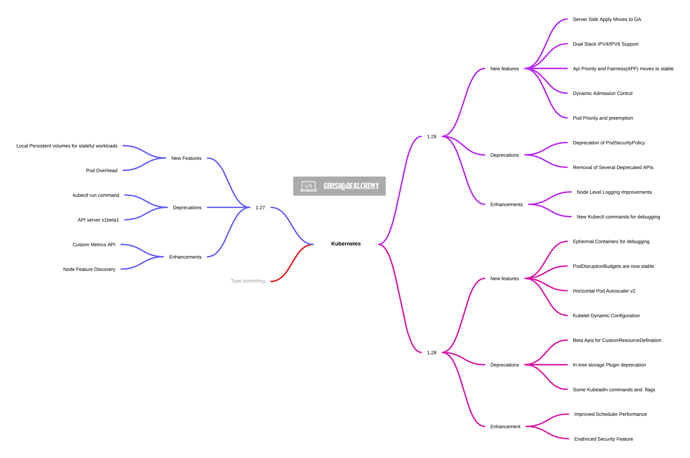

<h1 align="center"> <a href="https://girishcodealchemy.github.io/kubernetes-solutions/"> 🚀  Kubernetes Solutions 🚀 </a></h1>
<p align="center">    </p>
<blockquote align="center">
  Common issues and solutions related to Kubernetes
</blockquote>

---

## Kubernetes Architecture



---

## [🕸️ Kubernetes Sample Templates 🚀](./kubernetes-Templates/README.md)

---

# Common Issues & Solutions

## Issue 1: Ingress not getting removed

Even after running the command `kubectl delete ingress <ingress_name> --force --grace-period=0`, the Ingress is not getting removed.

> #### Solution:
>
> You can patch the Ingress using the following command:

```bash
kubectl patch ingress <name-of-the-ingress> -n <your-namespace> -p '{"metadata":{"finalizers":[]}}' --type=merge
```

<h1></h1>

## Issue 2: Debugging the Kubernetes Pod

> #### Solution:
>
> You can create a new Pod with the curl image and open a shell in it using the following command:

```bash
kubectl run curlpod --image=curlimages/curl -i --tty -- sh
```

Once you’ve finished testing, you can press Ctrl+D to escape the terminal session in the Pod. The Pod will continue running afterwards. You can check the status of the Pod using:

```bash
$ kubectl get pod curlpod
NAME        READY   STATUS    RESTARTS   AGE
curlpod   1/1     Running   1          72s

The Pod is still there!
```

You can re-enter the Pod again using the `kubectl exec` command:

```bash
kubectl exec -it curlpod sh
kubectl attach curlpod -c curlpod -i -t
```

Or, you can delete the Pod with the kubectl delete pod command:

```bash
kubectl delete po curlpod
```

<h1></h1>

## Issue 3: Drain the pods and delete the node

> #### Solution:
>
> You can patch the Ingress using the following command:

```bash
kubectl cordon <node_name>
kubectl drain <node_name>
kubectl delete node <node_name>
```

<h1></h1>

## Issue 4: Deschedule or cordon the nodes in kuberentes

> #### Solution:

```bash
kubectl cordon <node-name>
kubectl get nodes
```

Schedule the node back so that the pods can be scheduled

```bash
kubectl uncordon <node-name>
```

<h1></h1>

## Issue 5: Execute the command inside the container

> #### Solution:

```bash
kubectl exec -i -t <pod_name> -- cat /etc/resolv.conf
kubectl exec -i -t <pod_name> -- nslookup kubernetes.default
```

<h1></h1>

## Issue 6: Track and sort by pod memory usage

> #### Solution:

```bash
kubectl top pods -a --sort-by=memory
kubectl top pods -n <namespace> --selector=app=<app-lablename> --sort-by=memory
```

## Issue 7: Scale down/Up the replicas for deployments and statefulset

> #### Solution:

```bash
kubectl scale deployments <deployment-name> --replicas=<new-replicas>
kubectl scale statefulsets <stateful-set-name> --replicas=<new-replicas>
```

## Issue 8: Sort the pods based on the creation timestamp

> #### Solution:

```bash
kubectl get po -A --sort-by=.metadata.creationTimestamp
```

## Issue 9: Debugging Pods with Ephemeral Containers

> #### Solution:

```bash
kubectl alpha debug -it <podname> --image=busybox --target=containername
```

## Issue 9: Kubectl Debug for Direct Container Debugging

> #### Solution:

`kubectl debug` provides a way to create a temporary duplicate of a pod and replace its containers with debug versions or add new troubleshooting tools without affecting the original pod. This is incredibly useful for debugging issues in a live environment without impacting the running state of your application

```bash
kubectl debug pod/myapp-pod -it --copy-to=myapp-debug --container=myapp-container --image=busybox
```

## Issue 10: Kubernetes API for Dynamic Interaction and Automation

> #### Solution:

`kubectl debug` provides a way to create a temporary duplicate of a pod and replace its containers with debug versions or add new troubleshooting tools without affecting the original pod. This is incredibly useful for debugging issues in a live environment without impacting the running state of your application

```bash
curl -X GET https://<kubernetes-api-server>/api/v1/namespaces/default/pods \
  -H "Authorization: Bearer <your-access-token>" \
  -H 'Accept: application/json'
```

## Issue 11: Create the configmap pointing to a file

> #### Solution:
value.txt
```text
Hello world
```
```bash
kubectl create configmap test-cm --from-file=greeting=value.txt --namespace test
```


## Issue 12: Create the Deployment template 

> #### Solution:

```bash
kubectl create deployment sample-deployment --image=busybox -n test --replicas=5 --dry-run=client -o yaml > sample-deployment.yaml
```


## Issue 13: Create the nginx pod template 

> #### Solution:

```bash
kubectl run nginx --image=nginx --restart=Never  --port=80 --dry-run=client -o yaml
```


## Issue 14: Set the image to particular version without editing the image

> #### Solution:

```bash
kubectl set image pod/nginx nginx=nginx:1.15-alpine
```

## Issue 15: Check the image version without describe command

> #### Solution:

```bash
kubectl get po nginx -o jsonpath='{.spec.containers[].image}{"\n"}'
```

## Issue 16: Create a busybox pod with command sleep 3600

> #### Solution:

```bash
kubectl run busybox --image=busybox --restart=Never -- /bin/sh -c "sleep 3600"
```

## Issue 17: Create a busybox pod and echo message 'How are you' and have it deleted immediately

> #### Solution:
Use the `--rm` flag 
```bash
kubectl run busybox --image=nginx --restart=Never -it --rm -- echo "How are you"
```

## Issue 18: Different level of verbosity

> #### Solution:
Use the `--v` flag 

```bash
kubectl get po nginx --v=7
kubectl get po nginx --v=8
kubectl get po nginx --v=9
```

